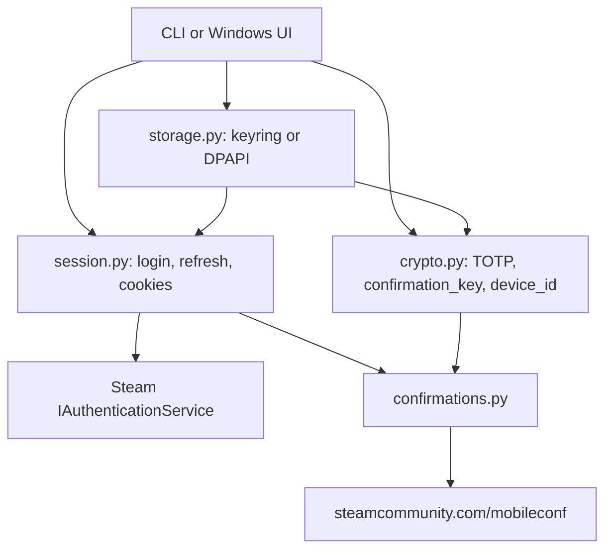

# Steam Guard in Python on Windows: research findings

## Scope and conclusion

This document covers how to build a Python-on-Windows Steam Guard helper that can:

1. generate Steam login authenticator codes from a Steam Guard `shared_secret`; and
2. fetch and approve/cancel Steam trade or Community Market transaction confirmations using an `identity_secret` and an authenticated Steam Community session.

Conclusion: the cryptographic pieces are small and deterministic, but the surrounding account/session flow is the risky part. A maintainable Windows implementation should keep the local TOTP and confirmation-key algorithms in a small audited module, isolate all Steam HTTP traffic behind a `requests.Session`, store secrets with Windows DPAPI or Windows Credential Manager via `keyring`, and test all algorithms with fixed timestamps plus mocked HTTP fixtures. The confirmation endpoints are not a stable public Web API; they are reverse-engineered mobile web endpoints used by community projects, so the code must treat endpoint shape changes as expected maintenance risk.

## Source map

| Source | What it established |
| --- | --- |
| [RFC 6238: TOTP](https://www.rfc-editor.org/rfc/rfc6238) | TOTP is HOTP with a Unix-time moving factor; default time step is 30 seconds; implementations need shared secret material and clock synchronization. |
| [Steam Support: Steam Guard](https://help.steampowered.com/en/faqs/view/06B0-26E6-2CF8-254C) | Steam Guard adds a second login factor; the Steam Mobile Authenticator generates a new code every 30 seconds. |
| [Steam Support: Trade and Market Confirmations](https://help.steampowered.com/en/faqs/view/2E6E-A02C-5581-8904) | Trades and market listings require final confirmation by email or mobile app; unconfirmed actions are not sent or posted. |
| [Steam Support: Steam Trade and Market Holds](https://help.steampowered.com/en/faqs/view/34A1-EA3F-83ED-54AB) | If an account is not protected by a mobile authenticator, outgoing items can be held; after a mobile authenticator has protected the account for 7 days, trade/market holds are removed. |
| [ValvePython/steam `steam/guard.py`](https://raw.githubusercontent.com/ValvePython/steam/master/steam/guard.py) | Python reference for Steam-style login codes, confirmation keys, Android device IDs, authenticator enrollment, server time offset, and rooted-Android secret extraction. |
| [bukson/steampy `guard.py`](https://raw.githubusercontent.com/bukson/steampy/master/steampy/guard.py) and [`confirmation.py`](https://raw.githubusercontent.com/bukson/steampy/master/steampy/confirmation.py) | Python trading library implementation of `shared_secret` TOTP, `identity_secret` confirmation keys, `mobileconf/getlist`, `mobileconf/ajaxop`, confirmation IDs, nonces, and `requests.Session` usage. |
| [bukson/steampy `login.py`](https://raw.githubusercontent.com/bukson/steampy/master/steampy/login.py) | Python example of modern login: fetch RSA key, encrypt password, begin auth session, submit Steam Guard code, poll auth status, finalize login, and copy cookies across Steam domains. |
| [xPaw Steam Web API: `IAuthenticationService`](https://steamapi.xpaw.me/IAuthenticationService) | Reference for `GetPasswordRSAPublicKey`, `BeginAuthSessionViaCredentials`, `UpdateAuthSessionWithSteamGuardCode`, `PollAuthSessionStatus`, `GenerateAccessTokenForApp`, and related auth/token methods. |
| [DoctorMcKay/node-steam-totp `index.js`](https://raw.githubusercontent.com/DoctorMcKay/node-steam-totp/master/index.js) | Clear implementation of Steam's custom 5-character TOTP output and base64 confirmation-key algorithm. |
| [DoctorMcKay/node-steamcommunity `confirmations.js`](https://raw.githubusercontent.com/DoctorMcKay/node-steamcommunity/master/components/confirmations.js) | Mature confirmation flow: list confirmations, inspect details, respond with `ajaxop`/`multiajaxop`, and account for current app tags (`list`, `accept`, `reject`) plus legacy tags (`conf`, `allow`, `cancel`). |
| [Sporoid/SteamAuthenticator](https://github.com/Sporoid/SteamAuthenticator) | Python desktop-style authenticator that displays TOTP codes and manages confirmations across accounts. Useful as a reference, but do not copy its credential-handling style as-is. |
| [Jessecar96/SteamDesktopAuthenticator](https://github.com/Jessecar96/SteamDesktopAuthenticator) | Desktop authenticator precedent and `maFiles` ecosystem; its own README warns that desktop authenticators reduce the security value of 2FA and require careful backups. |
| [mathielo gist: generating shared and identity secrets](https://gist.github.com/mathielo/8367e464baa73941a075bae4dd5eed90) | Practical account-enrollment workflow using ValvePython/steam; warns that secrets are generated at authenticator setup time and that removing/re-adding an authenticator can trigger trade holds. |
| [Python keyring documentation](https://keyring.readthedocs.io/en/latest/) | `keyring` provides cross-platform secret storage; on Windows it targets Windows Credential Locker and exposes `set_password`/`get_password`/`delete_password`. |
| [Microsoft DPAPI `CryptProtectData`](https://learn.microsoft.com/en-us/windows/win32/api/dpapi/nf-dpapi-cryptprotectdata) | DPAPI encrypts data so it is normally decryptable only by the same Windows logon user on the same computer; `CRYPTPROTECT_LOCAL_MACHINE` weakens this to any user on the machine and should be avoided for per-user Steam secrets. |
| [Microsoft Credentials Management API](https://learn.microsoft.com/en-us/windows/win32/secauthn/credentials-management) | Windows exposes credential-management APIs and UI for storing user credentials, which is the platform primitive behind credential-manager style storage. |

## Data model

A Steam Guard-backed app needs these account fields:

```json
{
  "account_name": "username",
  "steamid": "7656119...",
  "shared_secret": "base64 encoded secret for login TOTP",
  "identity_secret": "base64 encoded secret for confirmations",
  "revocation_code": "Rxxxxx recovery code",
  "device_id": "android:xxxxxxxx-xxxx-xxxx-xxxx-xxxxxxxxxxxx",
  "session": {
    "steamLoginSecure": "cookie or token-derived cookie value",
    "sessionid": "Steam Community session id"
  }
}
```

Key distinction:

- `shared_secret` signs the login code. It is base64 in Steam `.maFile`/ValvePython/steampy formats. Some `otpauth://` URIs expose an equivalent base32 secret, but the common desktop-bot files store base64.
- `identity_secret` signs mobile confirmation requests. It is also base64 and is not interchangeable with `shared_secret`.
- `revocation_code` is the account recovery/removal code. Store it separately from the app database; losing both authenticator files and revocation code can lock the user into Steam Support recovery.
- `device_id` is conventionally deterministic from SteamID64: SHA-1 of the Steam ID formatted as `android:8-4-4-4-12`. ValvePython, steampy, node-steam-totp, and Sporoid all implement this pattern.
- Session cookies/tokens are not permanent secrets, but they grant account access while valid. Treat them like secrets.

## TOTP / login code generation

Steam uses the HOTP/TOTP shape from RFC 6238, but the displayed code is Steam-specific:

1. Decode `shared_secret` from base64 to bytes.
2. Compute the time counter as `floor(unix_timestamp / 30)`. Steam Support confirms mobile authenticator codes refresh every 30 seconds.
3. Pack the counter as an unsigned 64-bit big-endian integer: `struct.pack('>Q', counter)`.
4. Compute `HMAC-SHA1(secret, packed_counter)`.
5. Use dynamic truncation: `offset = digest[19] & 0x0f`; read 4 bytes at that offset as big-endian; mask with `0x7fffffff`.
6. Convert the integer to 5 characters by repeated modulo against Steam's alphabet: `23456789BCDFGHJKMNPQRTVWXY`.

Reference Python implementation:

```python
import base64
import hmac
import hashlib
import struct
import time

STEAM_CHARS = "23456789BCDFGHJKMNPQRTVWXY"


def steam_totp(shared_secret_b64: str, timestamp: int | None = None) -> str:
    if timestamp is None:
        timestamp = int(time.time())

    secret = base64.b64decode(shared_secret_b64)
    counter = int(timestamp) // 30
    msg = struct.pack(">Q", counter)
    digest = hmac.new(secret, msg, hashlib.sha1).digest()

    offset = digest[19] & 0x0F
    code_int = struct.unpack(">I", digest[offset:offset + 4])[0] & 0x7FFFFFFF

    code = []
    for _ in range(5):
        code_int, idx = divmod(code_int, len(STEAM_CHARS))
        code.append(STEAM_CHARS[idx])
    return "".join(code)
```

Implementation notes:

- Do not use a stock `pyotp.TOTP(...).now()` output as the final Steam login code; Steam's display alphabet and length differ from RFC-style 6-digit OTPs. `pyotp` can still help parse standard `otpauth://` URIs, but the final Steam code should use the custom alphabet above.
- Accept an injected `timestamp` in the function. This makes tests deterministic and lets the UI show countdown state without hidden time calls.
- Querying Steam's `ITwoFactorService/QueryTime` can estimate server time offset. ValvePython and node-steam-totp both support this. On Windows, local NTP-synced clock is usually enough, but a production app should surface clock drift/skew errors and allow resync.
- The code is valid only for its 30-second time step. Always display remaining seconds so the user does not submit an almost-expired code.

## Transaction confirmation functionality

Steam's transaction confirmations cover outgoing trade offers and Community Market listings. Steam Support describes confirmations as the final step before a trade/listing is sent or posted; if the user does not confirm, the action does not complete. A Python implementation mimics the mobile app's signed `mobileconf` HTTP requests.

### Confirmation-key generation

`identity_secret` signs confirmation requests. The algorithm is distinct from login TOTP because it signs the raw Unix timestamp plus a request tag, not `timestamp // 30`.

```python
import base64
import hmac
import hashlib
import struct
import time


def confirmation_key(identity_secret_b64: str, tag: str, timestamp: int | None = None) -> tuple[int, str]:
    """Return (timestamp, base64 HMAC-SHA1 confirmation key)."""
    if timestamp is None:
        timestamp = int(time.time())

    secret = base64.b64decode(identity_secret_b64)
    payload = struct.pack(">Q", int(timestamp)) + tag.encode("ascii")
    key = hmac.new(secret, payload, hashlib.sha1).digest()
    return int(timestamp), base64.b64encode(key).decode("ascii")
```

Tag choices seen in current and legacy clients:

| Use | Current app / node-steamcommunity tag | Legacy tag used by Python libraries | Notes |
| --- | --- | --- | --- |
| List pending confirmations | `list` | `conf` | `getlist` accepts both in community implementations; the generated key must use the same tag sent in the query. |
| Confirmation details | `detail` | `details` or `details{id}` | Libraries differ by endpoint variant. Use details only when list metadata is insufficient. |
| Approve/accept | `accept` | `allow` | The `op` query parameter is usually `allow`; the key tag may be `accept` or `allow` depending on compatibility target. |
| Cancel/deny | `reject` | `cancel` | The `op` query parameter is usually `cancel`; the key tag may be `reject` or `cancel`. |

### Device ID

```python
import hashlib


def generate_device_id(steamid64: str) -> str:
    digest = hashlib.sha1(str(steamid64).encode("ascii")).hexdigest()
    return "android:%s-%s-%s-%s-%s" % (
        digest[:8],
        digest[8:12],
        digest[12:16],
        digest[16:20],
        digest[20:32],
    )
```

### Fetching confirmations

The common request is `GET https://steamcommunity.com/mobileconf/getlist` with an authenticated Steam Community session and mobile-style parameters.

Minimum parameters:

```python
def confirmation_params(steamid64: str, device_id: str, identity_secret_b64: str, tag: str) -> dict[str, str | int]:
    timestamp, key = confirmation_key(identity_secret_b64, tag)
    return {
        "p": device_id,       # android:... device id
        "a": steamid64,      # SteamID64/account id accepted by endpoint
        "k": key,            # base64 HMAC-SHA1 confirmation key
        "t": timestamp,      # raw Unix timestamp, not timestamp // 30
        "m": "android",      # "react" also appears in newer clients
        "tag": tag,
    }
```

Typical fetch:

```python
import requests


def get_confirmations(session: requests.Session, account) -> list[dict]:
    params = confirmation_params(
        steamid64=account.steamid64,
        device_id=account.device_id,
        identity_secret_b64=account.identity_secret,
        tag="conf",  # or "list" for current-app-style requests
    )
    headers = {"X-Requested-With": "com.valvesoftware.android.steam.community"}
    response = session.get(
        "https://steamcommunity.com/mobileconf/getlist",
        params=params,
        headers=headers,
        timeout=15,
    )
    response.raise_for_status()
    data = response.json()
    if not data.get("success"):
        raise RuntimeError(data.get("message") or data.get("detail") or "confirmation list failed")
    return data.get("conf", [])
```

Fields commonly used from each confirmation item:

- `id`: confirmation ID, passed as `cid` to `ajaxop`.
- `nonce`: per-confirmation key, passed as `ck` to `ajaxop`; do not confuse this with the generated HMAC `k` parameter.
- `creator_id`: object identifier, often the trade offer ID or market listing object to match.
- `type`, `type_name`, `headline`, `summary`, `creation_time`: UI and safety-review metadata.

### Approving or cancelling a transaction

To act on a confirmation, call `GET https://steamcommunity.com/mobileconf/ajaxop` for a single confirmation. `node-steamcommunity` uses `POST https://steamcommunity.com/mobileconf/multiajaxop` for batched actions; a first implementation should keep single-confirmation actions because error handling is clearer.

```python
def respond_to_confirmation(session: requests.Session, account, confirmation: dict, accept: bool) -> bool:
    op = "allow" if accept else "cancel"
    tag = "allow" if accept else "cancel"  # alternatives: "accept" / "reject"
    params = confirmation_params(account.steamid64, account.device_id, account.identity_secret, tag)
    params.update({
        "op": op,
        "cid": confirmation["id"],
        "ck": confirmation["nonce"],
    })
    headers = {"X-Requested-With": "XMLHttpRequest"}
    response = session.get(
        "https://steamcommunity.com/mobileconf/ajaxop",
        params=params,
        headers=headers,
        timeout=15,
    )
    response.raise_for_status()
    return bool(response.json().get("success"))
```

Safety checks before calling `respond_to_confirmation`:

1. Display the account name, confirmation type, headline, summary, and `creator_id`.
2. If approving a known trade offer or market listing, match the confirmation by `creator_id` or by a details request before approving.
3. Require an explicit user action unless the product requirement is a bot that auto-accepts a narrow allowlist.
4. Never auto-accept unknown confirmation types. Known types include trades and market listings; other types can include phone-number changes or account recovery related prompts.
5. Avoid reusing the same `(timestamp, tag)` for multiple actions when a library warns that confirmation keys are single-use. If batching, follow node-steamcommunity's `multiajaxop` pattern and track used confirmation times.

### Confirmation endpoint matrix

| Operation | Endpoint | Method | Key tag | Extra parameters | Expected response |
| --- | --- | --- | --- | --- | --- |
| List pending confirmations | `/mobileconf/getlist` | `GET` | `conf` or `list` | standard `p`, `a`, `k`, `t`, `m`, `tag` | JSON with `success` and `conf` array; `needauth` means the session expired. |
| Fetch one confirmation detail page | `/mobileconf/details/{id}` or `/mobileconf/detailspage/{id}` | `GET` | `details`, `detail`, or `details{id}` depending on client convention | standard params only | HTML or JSON-wrapped HTML used to extract the trade offer ID when list metadata is not enough. |
| Approve one confirmation | `/mobileconf/ajaxop` | `GET` in Python references | `allow` or `accept` | `op=allow`, `cid=<confirmation id>`, `ck=<confirmation nonce>` | JSON with `success=true`; otherwise show Steam's `message`/`detail`. |
| Cancel one confirmation | `/mobileconf/ajaxop` | `GET` in Python references | `cancel` or `reject` | `op=cancel`, `cid=<confirmation id>`, `ck=<confirmation nonce>` | JSON with `success=true`; failure should leave the item visible after a list refresh. |
| Batch approve/cancel | `/mobileconf/multiajaxop` | `POST` in node-steamcommunity | same as approve/cancel | repeated/array `cid` and `ck` values | Useful only after single-confirmation flow is reliable; partial failure visibility is weaker. |

Response-handling rules:

- Treat HTTP errors, JSON parse errors, `success=false`, `needauth=true`, and Steam's "incorrect Steam Guard codes" text as different failure classes; only the first two are transport/format failures.
- Refresh the list after every approve/cancel and verify the target confirmation disappeared before reporting success to the user.
- Keep `id`/`nonce` pairs short-lived. If the user waits several minutes on a confirmation screen, refresh before submitting.
- Prefer user-triggered refresh over background polling. If polling is needed, use a conservative interval and stop while an approve/cancel request is in flight.

## Authenticated session options

The cryptographic functions do not log in by themselves. Confirmation endpoints require a valid Steam Community web/mobile session. Existing projects show three approaches:

1. **Use a library-managed session.** `steampy` logs in with username, password, API key, and a Steam Guard file, then keeps a `requests.Session`. This is the fastest route if the app's scope is trading/market automation.
2. **Use ValvePython/steam for enrollment and auth support.** ValvePython's `SteamAuthenticator` can add an authenticator, save secrets, compute codes, and obtain a web session through `MobileWebAuth`/`SteamClient`. Check dependency compatibility before committing to it for a new Windows app.
3. **Implement modern Steam authentication directly.** Sporoid's project shows calls around `IAuthenticationService/GetPasswordRSAPublicKey`, `BeginAuthSessionViaCredentials`, `UpdateAuthSessionWithSteamGuardCode`, `PollAuthSessionStatus`, and token refresh. This path gives control but is more maintenance-heavy.

For a Windows desktop tool, prefer option 1 or 2 unless you specifically need to own the login/token lifecycle. If you do implement login directly, keep it separate from TOTP/confirmation signing so endpoint churn does not touch the cryptographic core.

Session-cookie notes:

- A valid `steamLoginSecure` cookie and `sessionid` are needed for `steamcommunity.com` confirmation requests.
- Some newer mobile flows use JWT access/refresh tokens and synthesize mobile cookies such as `steamLoginSecure=<steamid>||<access_token>`, plus `mobileClient` and `mobileClientVersion`. Verify against live Steam behavior in a controlled account because this is not an official public contract.
- Expired tokens should trigger a session refresh, not silent approval failure. Surface `needauth`, HTTP 401/403, or Steam's "incorrect Steam Guard codes" messages clearly.

Modern credential login state machine if direct login is required:

1. `GET IAuthenticationService/GetPasswordRSAPublicKey/v1` with `account_name`; use the returned RSA modulus, exponent, and timestamp to encrypt the password client-side.
2. `POST IAuthenticationService/BeginAuthSessionViaCredentials/v1` with `account_name`, `encrypted_password`, `encryption_timestamp`, persistence/platform fields, and device details. Capture `client_id`, `request_id`, `steamid`, and `allowed_confirmations`/challenge state from the response.
3. If the account requires a mobile code, generate `steam_totp(shared_secret)` and call `POST IAuthenticationService/UpdateAuthSessionWithSteamGuardCode/v1` with `client_id`, `steamid`, `code`, and `code_type=3` for app/mobile authenticator code. If the service returns captcha, email, risk quiz, or mobile push approval instead, do not fake success; route the user through that challenge or abort.
4. `POST IAuthenticationService/PollAuthSessionStatus/v1` with `client_id` and `request_id` until Steam returns tokens or a terminal failure. Polling should have a short finite timeout and backoff; do not loop forever.
5. Finalize web login and transfer cookies to `steamcommunity.com`, `store.steampowered.com`, and `help.steampowered.com`. `steampy` calls `login/jwt/finalizelogin` with the refresh token nonce, then propagates `steamLoginSecure` and `sessionid` across domains.
6. Store refresh/access tokens in the secret store and refresh them before expiry. If token refresh fails, clear only volatile session state and ask the user to log in again.

Do not store the account password unless the product explicitly needs unattended relogin. A desktop authenticator can normally store `shared_secret`/`identity_secret` and require the user to re-enter the password when the web session expires.

Library-choice guidance:

- Choose `steampy` when the product is mainly a trading/market bot and an API-key-backed trading client is already acceptable. It already models trade offers and has a Python confirmation executor, but it currently requires Python 3.12 and brings trading concerns into the authenticator boundary.
- Choose `ValvePython/steam` when authenticator enrollment, revocation, server-time offset, or web-session acquisition is more important than a narrow confirmation client. It is the best Python source for the add/finalize authenticator lifecycle, but that lifecycle is account-sensitive and should not be mixed into the first version unless enrollment is a requirement.
- Choose a direct `requests.Session` confirmation client when the app already has a valid Steam Community session and only needs TOTP plus confirmation list/approve/cancel. This has the smallest code surface, but it inherits the most endpoint-maintenance risk.
- Do not combine all three approaches in one code path. Keep one session owner and pass only a session-like object to `confirmations.py`; otherwise token refresh, cookies, and error handling will diverge.

## Getting `shared_secret` and `identity_secret`

There is no safe generic way to recover secrets from an arbitrary already-enabled Steam Mobile Authenticator. Source projects consistently treat the secrets as provisioning data that must be saved when the authenticator is added.

Supported acquisition paths:

1. **During authenticator enrollment.** ValvePython's `SteamAuthenticator.add()` calls Steam's two-factor service and returns fields including `shared_secret`, `identity_secret`, and `revocation_code`; the mathielo guide demonstrates saving these values before finalizing setup. This may require removing/re-adding an existing authenticator and can trigger Steam trade/market holds.
2. **Import from existing `.maFile`.** SteamDesktopAuthenticator and similar tools store `maFiles` that contain account secrets and session data. Importing should require the user to choose the file and decrypt it if encrypted.
3. **Rooted Android extraction.** ValvePython includes `extract_secrets_from_android_rooted`; this requires a rooted Android device and `adb`. It is fragile and should be treated as an advanced recovery path, not a normal Windows app feature.

Do not encourage users to paste secrets into web forms or chat logs. Never log `shared_secret`, `identity_secret`, `steamLoginSecure`, access tokens, refresh tokens, passwords, or revocation codes.

Authenticator-enrollment sequence if the app must create new secrets:

1. Require a verified phone number and a deliberately chosen disposable/low-value account for the first test. ValvePython checks phone status before `AddAuthenticator`.
2. If the account already has a mobile authenticator, stop and explain the hold/lockout risk. Do not remove an existing authenticator automatically.
3. Start enrollment with Steam's `AddAuthenticator` equivalent using the account SteamID, current authenticator time, `ValveMobileApp` authenticator type, deterministic `device_identifier`, and SMS phone ID.
4. Immediately persist the returned `shared_secret`, `identity_secret`, `revocation_code`, `serial_number`, `token_gid`, and `uri` before finalization. This is the only point where losing process state can permanently lose the newly issued secrets.
5. Ask the user for the SMS activation code and finalize with `FinalizeAddAuthenticator`, passing both the activation code and the current Steam TOTP code generated from the newly returned `shared_secret`.
6. Handle Steam's `want_more`/time-skew retry behavior by advancing the authenticator timestamp in one 30-second step, as ValvePython does, but cap retries.
7. After finalization succeeds, show the revocation code once with a backup warning, then move all secrets into the Windows secret store and remove plaintext temporary files.

Enrollment is not required for a research-backed first implementation if the user can import an existing `.maFile`; import is lower API-risk and avoids intentionally changing account security state.

`.maFile` import normalization:

```python
from dataclasses import dataclass
from typing import Any


@dataclass(frozen=True)
class ImportedSteamGuard:
    account_name: str | None
    steamid64: str
    shared_secret: str
    identity_secret: str
    revocation_code: str | None
    device_id: str | None
    refresh_token: str | None
    access_token: str | None


def parse_mafile(raw: dict[str, Any]) -> ImportedSteamGuard:
    steamid = str(raw.get("steamid") or raw.get("SteamID") or raw.get("Session", {}).get("SteamID") or "")
    shared = raw.get("shared_secret")
    identity = raw.get("identity_secret")
    if not steamid.isdecimal() or len(steamid) < 16:
        raise ValueError("missing SteamID64")
    if not isinstance(shared, str) or not shared:
        raise ValueError("missing shared_secret")
    if not isinstance(identity, str) or not identity:
        raise ValueError("missing identity_secret")
    session = raw.get("Session") if isinstance(raw.get("Session"), dict) else {}
    return ImportedSteamGuard(
        account_name=raw.get("account_name"),
        steamid64=steamid,
        shared_secret=shared,
        identity_secret=identity,
        revocation_code=raw.get("revocation_code"),
        device_id=raw.get("device_id"),
        refresh_token=session.get("RefreshToken"),
        access_token=session.get("AccessToken"),
    )
```

Import rules:

- Validate base64 decoding for both secrets before storing them.
- Accept `.maFile` fields case-insensitively only where source projects demonstrably vary; do not silently guess missing secrets.
- If the imported file contains session tokens, store them as volatile credentials and still support re-login when they expire.
- If the file is encrypted by SteamDesktopAuthenticator, require the user to decrypt it in the source app or implement the exact source-app decryptor; do not brute-force or bypass user-owned encryption.
- After successful import, write only normalized metadata to config and store raw secrets in the secret backend. Do not keep a copied plaintext `.maFile`.

## Windows Python implementation plan

Recommended package layout:

```text
steamguard_pc/
  __init__.py
  models.py              # Account dataclasses / pydantic models
  crypto.py              # steam_totp, confirmation_key, generate_device_id
  storage.py             # DPAPI/keyring-backed secret storage
  session.py             # Steam login/session refresh abstraction
  confirmations.py       # getlist/details/ajaxop client
  cli.py or app.py        # CLI/Tkinter/Qt UI entry point
  tests/
    test_crypto.py
    test_confirmations.py
```

Recommended runtime boundaries:



Boundary rules:

- `crypto.py` must be pure and offline: no HTTP, no files, no global clock except optional default `time.time()` wrappers. Every public function should accept injected timestamps for tests.
- `storage.py` owns secret persistence and redaction. Other modules receive specific secret strings only for the duration of an operation.
- `session.py` owns cookies, access tokens, refresh tokens, and login challenges. It should expose `get_community_session()` and hide token-transfer details.
- `confirmations.py` owns endpoint URLs, tags, request parameters, and response parsing. It should not know account passwords or write secrets.
- The UI owns consent. `confirmations.py` may expose `approve()` and `cancel()`, but only the UI or an explicitly configured allowlist policy should decide to call them.

Recommended dependencies:

- `requests` or `httpx` for HTTP. `requests.Session` matches most reference Python projects.
- `keyring` for Windows Credential Manager integration, or direct DPAPI through `pywin32`/`win32crypt` if the app needs no cross-platform storage abstraction.
- `cryptography` only if you need an app-level encrypted export/import format; avoid inventing custom encryption.
- `pydantic` or dataclasses for validating imported `.maFile` records.
- `pytest`, `responses` or `requests-mock`, and optionally `freezegun` for deterministic tests.
- `pyinstaller` or `pipx`/venv scripts for Windows distribution.

Windows storage recommendations:

- Store non-secret config under `%APPDATA%\SteamGuardPC\config.json` or `%LOCALAPPDATA%\SteamGuardPC` using `pathlib.Path(os.environ["APPDATA"])`.
- Store each `shared_secret`, `identity_secret`, refresh token, and `steamLoginSecure` in Windows Credential Manager/DPAPI, keyed by SteamID64.
- Keep `.maFile` imports out of the project directory and warn if the selected file is inside a Git checkout, Downloads, or cloud-sync folder.
- Add a lock/single-instance guard if the UI can approve confirmations; two processes could otherwise reuse stale confirmation data.

Recommended `storage.py` boundary:

```python
import keyring

SERVICE = "SteamGuardPC"


def _secret_name(steamid64: str, field: str) -> str:
    return f"{steamid64}:{field}"


def put_secret(steamid64: str, field: str, value: str) -> None:
    keyring.set_password(SERVICE, _secret_name(steamid64, field), value)


def get_secret(steamid64: str, field: str) -> str | None:
    return keyring.get_password(SERVICE, _secret_name(steamid64, field))


def delete_secret(steamid64: str, field: str) -> None:
    keyring.delete_password(SERVICE, _secret_name(steamid64, field))
```

If using DPAPI directly through `win32crypt.CryptProtectData`, bind encrypted blobs to the current user and current machine. Do not set a local-machine scope for Steam secrets; Microsoft documents that `CRYPTPROTECT_LOCAL_MACHINE` lets any user on that computer decrypt the protected data. Also avoid portable encrypted JSON as the default because users will copy it into backups, sync folders, and support tickets.

Separate durable metadata from secrets:

- Plain config: account display name, SteamID64, preferred polling interval, UI options, last successful sync timestamp.
- Secret store: `shared_secret`, `identity_secret`, refresh token, `steamLoginSecure`, password only if unavoidable.
- Export: require an explicit encrypted export passphrase and include `revocation_code` only if the user opts in after a warning.

## Testing and verification strategy

Cryptographic tests should be entirely offline:

- Use fixed base64 test secrets and fixed timestamps.
- Compare `steam_totp()` outputs against fixtures generated by at least one known implementation such as ValvePython/steam, steampy, or node-steam-totp.
- Test boundary timestamps around a 30-second rollover: `t=29`, `t=30`, `t=31`.
- Test confirmation key generation with fixed `identity_secret`, timestamp, and tags `conf`, `list`, `allow`, `accept`, `cancel`, and `reject`.
- Test `generate_device_id()` with a fixed SteamID64.

HTTP tests should use mocked responses:

- `getlist` success with two confirmations; assert `id`, `nonce`, `creator_id`, and summaries are preserved.
- `getlist` failure with `needauth`; assert the app requests session refresh.
- `ajaxop` approval success and failure.
- Unknown confirmation `type`; assert no auto-approval.
- Details lookup if the product relies on details pages for trade-offer IDs.

Manual smoke testing should use a disposable or low-value Steam account. The test should create a harmless confirmation, fetch it, display it, and cancel it. Do not run automated tests against a real primary account.

### Deterministic offline fixtures

The following non-secret fixtures are useful for smoke-testing independent implementations. They were generated from the algorithms in this document with fixed timestamps and no network access.

```text
shared_secret_b64  = MDEyMzQ1Njc4OWFiY2RlZmdoaWo=  # b"0123456789abcdefghij"
identity_secret_b64 = aWRlbnRpdHktc2VjcmV0LTEyMzQ= # b"identity-secret-1234"
steamid64 = 76561197960287930

steam_totp(shared_secret_b64, 0)          == CX2MR
steam_totp(shared_secret_b64, 29)         == CX2MR
steam_totp(shared_secret_b64, 30)         == 57G3M
steam_totp(shared_secret_b64, 31)         == 57G3M
steam_totp(shared_secret_b64, 1700000000) == C96G3
steam_totp(shared_secret_b64, 1700000029) == JGGKH
steam_totp(shared_secret_b64, 1700000030) == JGGKH

confirmation_key(identity_secret_b64, "conf",    1700000000) == 6eXMXFho61EmjoiIvP/WlyItlCU=
confirmation_key(identity_secret_b64, "list",    1700000000) == 43vC3oBlbDh0ZI7+uZxuhTZNyeo=
confirmation_key(identity_secret_b64, "allow",   1700000000) == m/CyWI2HN6Rf8GQWBeANc91afxo=
confirmation_key(identity_secret_b64, "accept",  1700000000) == 7OA8LfG6pJsWfVIZYl3So5TAslc=
confirmation_key(identity_secret_b64, "cancel",  1700000000) == ovSyaVuSNsfuuu1+2OjZmxQDFlo=
confirmation_key(identity_secret_b64, "reject",  1700000000) == gWWBsB1CkfuBS8H4Su/CsZyjHao=
confirmation_key(identity_secret_b64, "details", 1700000000) == uAqZHEDskpFL2AOFSbIQ4/DrZ34=
confirmation_key(identity_secret_b64, "detail",  1700000000) == tfFYzPMRksK8n2XMJmUarFt+i/0=

generate_device_id(steamid64) == android:6d3f10d9-6369-a1ae-97a0-94df28b95192
```

A minimal unit suite should assert exact equality for these values and should include negative tests for malformed base64, missing `identity_secret`, and non-ASCII tags.

## Risks and constraints

- **Private endpoints.** `steamcommunity.com/mobileconf/*` is not documented as a stable public API. Existing libraries work by matching mobile app behavior; tags, headers, cookie requirements, or token shape can change.
- **2FA security tradeoff.** A desktop authenticator on the same Windows machine as the Steam client reduces the protection of a second physical factor. SteamDesktopAuthenticator explicitly warns about this. The safest design is a local user-controlled tool, not a background auto-approver.
- **Account lockout.** Losing `maFiles`, encrypted storage keys, or revocation code can lock the user out or force Steam Support recovery.
- **Trade holds.** Removing/re-adding a mobile authenticator can cause trade/market holds. Steam Support says outgoing items can be held for up to 15 days when not protected by a mobile authenticator, and holds are removed after the authenticator has protected the account for 7 days.
- **Clock drift.** TOTP and confirmation signatures depend on Unix time. Query server time or instruct users to keep Windows time synchronized.
- **Rate limits and abuse.** Polling confirmations too frequently can look bot-like. `node-steamcommunity` suggests polling intervals should be at least 10 seconds; a desktop UI can poll less often or only on user request.
- **Credential handling.** Do not hard-code usernames/passwords. Sporoid's repository is useful for flow research, but any production Windows app should externalize and encrypt credentials.

Maintenance playbook for endpoint breakage:

- If TOTP login codes fail but the same account works in the official mobile app, first compare local time against Steam server time and then run the offline crypto fixtures. Do not change the TOTP alphabet or hash algorithm without source evidence.
- If `getlist` returns `needauth` or an empty response for all accounts, treat the web session as expired before suspecting `identity_secret` corruption.
- If `getlist` succeeds but `ajaxop` fails, verify that the generated confirmation key tag matches the endpoint convention (`allow`/`cancel` versus `accept`/`reject`), that `cid` is the confirmation `id`, and that `ck` is the confirmation `nonce`.
- If trade-offer matching breaks, stop using brittle HTML selectors until details parsing is re-verified against a fresh mocked fixture copied from a disposable account.
- If Steam changes token/cookie format, keep the confirmation-signing code unchanged and update only `session.py`; this is why the document recommends a separate session owner.
- If users report duplicate approvals or stale UI, add a per-account operation lock and force a list refresh before and after every action.

Logging policy:

- Safe to log: endpoint name, HTTP status, Steam `success` boolean, error class, elapsed time, account display alias, confirmation type.
- Redact or hash: SteamID64 if logs leave the user's machine.
- Never log: `shared_secret`, `identity_secret`, TOTP code, confirmation key `k`, confirmation nonce `ck`, `steamLoginSecure`, refresh/access tokens, password, revocation code, full `.maFile` JSON.

## Recommended minimal viable implementation

1. Implement `crypto.py` with `steam_totp`, `confirmation_key`, and `generate_device_id`; unit-test with fixed timestamps.
2. Implement secret import for a user-selected `.maFile` containing at least `steamid`, `shared_secret`, and `identity_secret`; store secrets with DPAPI/keyring.
3. Display login TOTP codes with a 30-second countdown and clock-drift warning.
4. Add a session abstraction around `requests.Session`; initially accept user-provided valid cookies for manual testing, then add library-backed login if needed.
5. Implement `get_confirmations()` against `mobileconf/getlist` and render `headline`, `summary`, `type`, `creator_id`, `id`, and `nonce`.
6. Implement explicit approve/cancel against `mobileconf/ajaxop`; never auto-approve by default.
7. Add mocked HTTP tests before testing on a disposable account.

This meets the required Steam Guard features: TOTP is handled locally through the `shared_secret`, and transaction confirmation is handled through signed `identity_secret` keys plus authenticated `mobileconf` requests.
